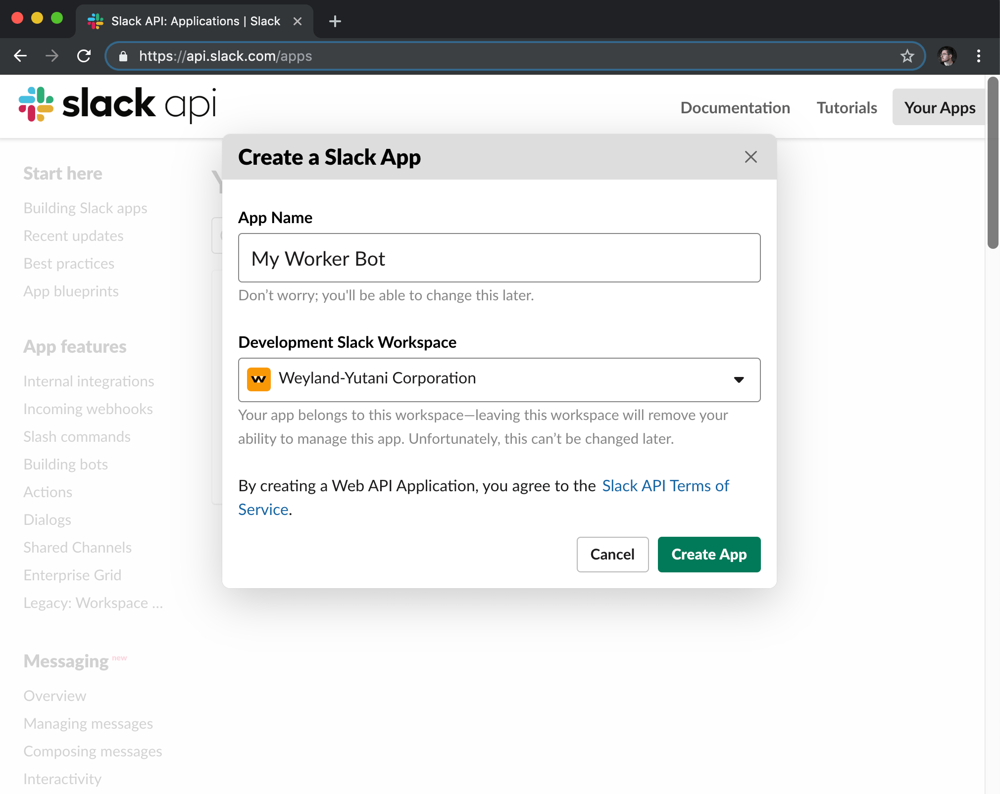
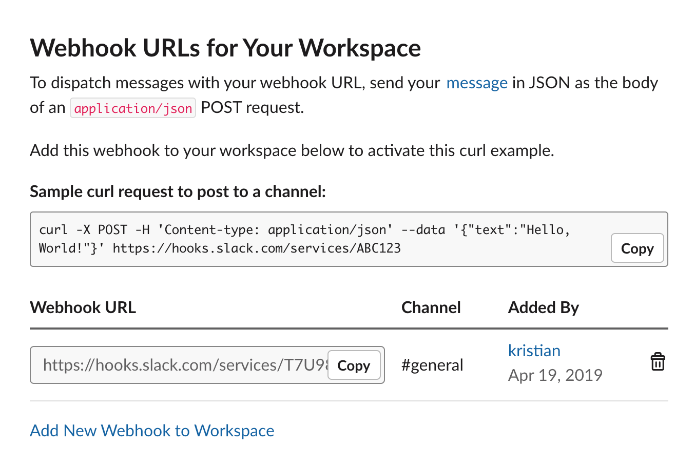
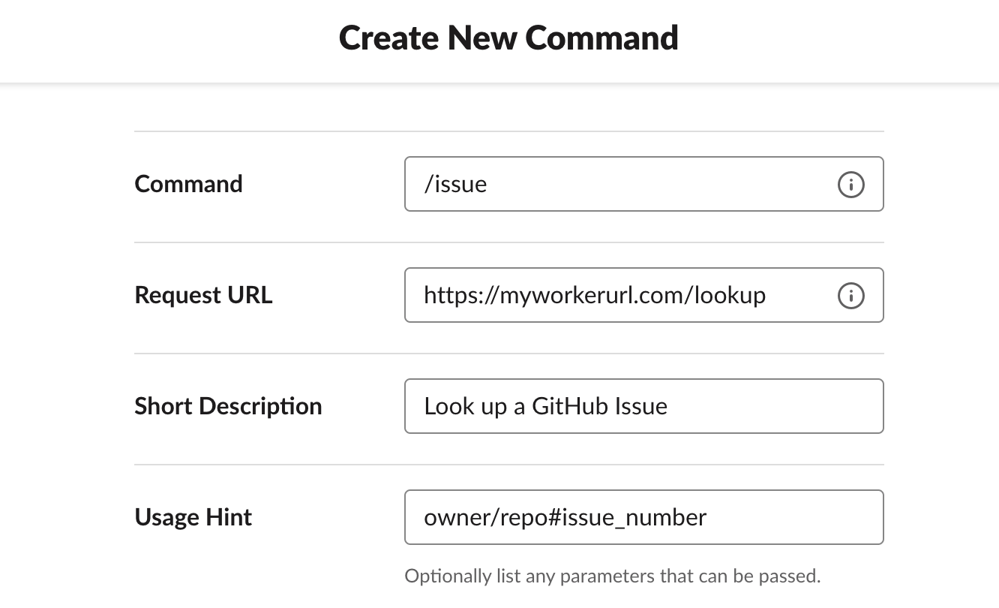
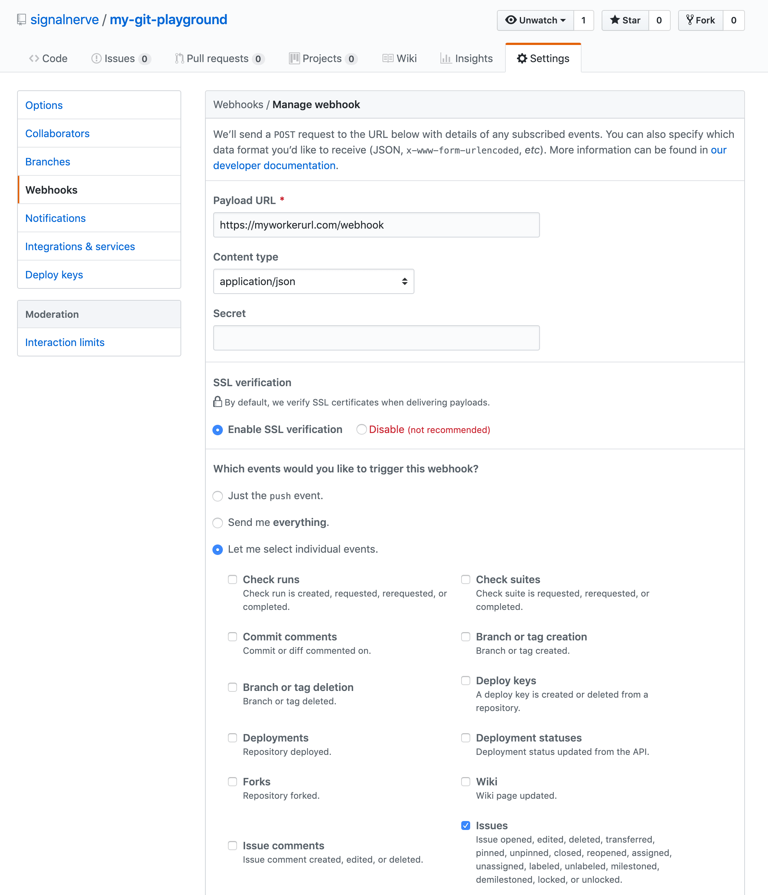
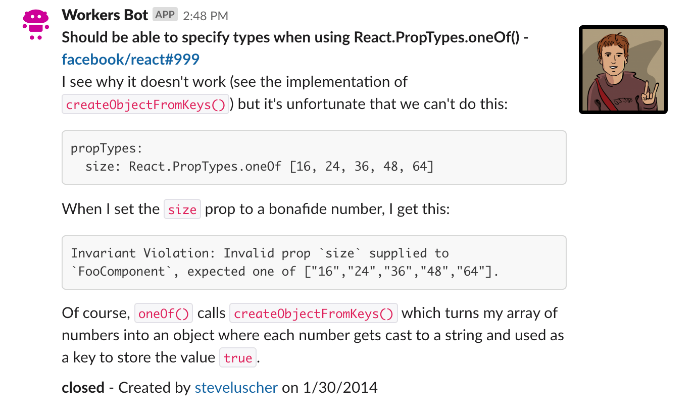
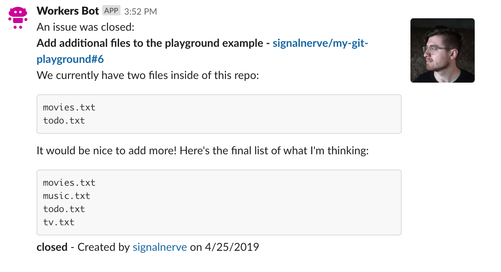
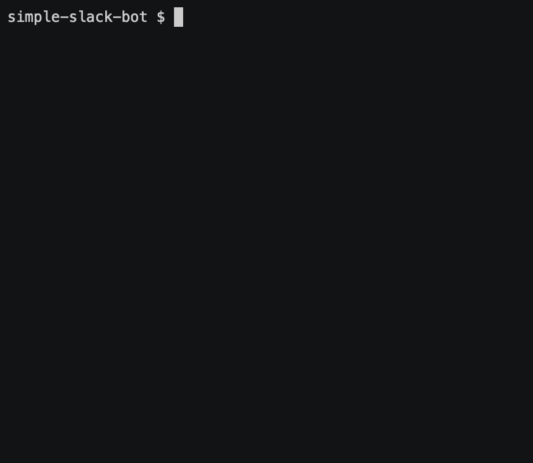
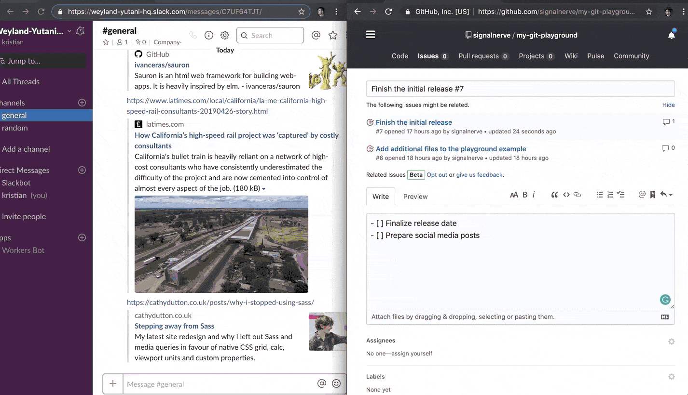

# Build a Slackbot

In this tutorial, you’ll build a [Slack](https://slackhq.com) bot using [Cloudflare Workers](https://workers.cloudflare.com). Your bot will make use of GitHub webhooks to send messages to a Slack channel when issues are updated or created, and allow users to write a command to look up GitHub issues from inside Slack.


This tutorial makes use of [Wrangler](https://github.com/cloudflare/wrangler), our command-line tool for generating, building, and publishing projects on the Cloudflare Workers platform. If you haven’t used Wrangler, we recommend checking out the [Quick Start Guide](/quickstart), which will get you set up with Wrangler, and familiar with the basic commands.

This tutorial is recommended for people who are familiar with writing web applications. If you’ve ever built an application with tools like [Node](https://nodejs.org) and [Express](https://expressjs.com), this project will feel very familiar to you. That being said, if you’re new to writing web apps, we think that Workers is a super easy way to focus on writing code, and actually shipping projects: maybe you’ve wanted to build something like a Slack bot in the past, but things like deployment and configuration have always seemed a little scary. In either case, welcome!

One more thing before you start the tutorial: if you’d like to see the code, or how the bot works in an actual Slack channel, we’ve made the final version of the codebase [available on GitHub](https://github.com/signalnerve/workers-slack-bot). From there, you can add your own Slack API keys, and deploy it to your own Slack channels for testing.

## Prerequisites

To publish your Worker to Cloudflare, and configure it with a Slack channel, you’ll need a few things:

- A Cloudflare account, and access to the API keys for that account
- A Slack channel, and the ability to create and manage Slack applications
- A Wrangler installation running locally on your machine, and access to the command-line

If you don’t have those things quite yet, don’t worry. We’ll walk through each of them and make sure we’re ready to go, before you start creating your application.

You’ll need to get your Cloudflare API keys to deploy code to Cloudflare Workers: see [“Finding your Cloudflare API keys”](/quickstart/#configure) for a brief guide on how to find them.

### Configure a Slack application

To post messages from your Cloudflare Worker into a Slack channel, you’ll need to create an application in Slack’s UI. To do this, go to Slack’s API section, at [api.slack.com/apps](https://api.slack.com/apps), and select “Create New App”.



Slack applications have a ton of features, but we’ll make use of two of them, _Incoming Webhooks_, and _Slash Commands_, to build your Worker-powered Slack bot.

#### Incoming Webhook

_Incoming Webhooks_ are URLs that you can use to send messages to your Slack channels. Your incoming webhook will be paired with GitHub’s webhook support to send messages to a Slack channel whenever there is updates to issues in a given repository. You’ll see the code in more detail as you build your application, but for now, let’s create the Slack webhook.

On the sidebar, select _Incoming Webhooks_, and in the section “Webhook URLs for your Workspace”, select “Add New Webhook to Workspace”. On the following screen, select the channel that you want your webhook to send messages to: you can select a room, like #general or #code, or be DMed directly by our Slack bot when the webhook is called. Authorizing the new webhook URL should bring you back to the _Incoming Webhooks_ page, where you’ll be able to view your new webhook URL. You’ll add this into our Workers code later: for now, let’s move onto adding the second component of your Slack bot, a _Slash Command_.



#### Slash Command

A _Slash Command_ in Slack is a custom-configured command that can be attached to a URL request: for instance, if you configured `/weather <zip>`, Slack would make an HTTP POST request to a configured URL, passing the text `<zip>` to get the weather for a specified zip code. In your application, you’ll use the `/issue` command to look up GitHub issues using the [GitHub API](https://developer.github.com). Typing `/issue cloudflare/wrangler#1` will send an HTTP POST request to our application, sending the text `cloudflare/wrangler#1`, which the application will use to find the [relevant GitHub issue](https://github.com/cloudflare/wrangler/issues/1).

On the sidebar, select _Slash Commands_, and create your first slash command. For our example, you’ll use the command `/issue`. The request URL should be the `/lookup` path on your application URL: for instance, if your application will be hosted at `https://myworkerurl.com`, the Request URL should be `https://myworkerurl.com/lookup`.



### Configure your GitHub Webhooks

Your Cloudflare Workers application will be able to handle incoming requests from Slack, but it should also be able to receive events directly from GitHub: if an issue is created or updated, you can make use of GitHub webhooks to send that event to your Workers application, and post a corresponding message in Slack.

To configure a webhook, you’ll need access to a repository on GitHub, and permissions to add and manage webhooks via the “Webhooks” section inside your repository’s “Settings” in the GitHub UI. If you have a repository like `https://github.com/user/repo`, you can access the “Webhooks” page directly at `https://github.com/user/repo/settings/hooks`.

Create a new webhook, and set the Payload URL to the `/webhook` path on your Worker URL: for instance, if your Worker will be hosted at `https://myworkerurl.com`, the Payload URL should be `https://myworkerurl.com/webhook`. The _Content type_ for your payload can either be a URL-encoded payload (`application/x-www-form-urlencoded`), or JSON (`application/json`): to make parsing the payload sent to our application, we’ll select JSON.

GitHub webhooks allow you to specify which events you’d like to have sent to your webhook: by default, the webhook will send `push` events from your repository. Instead of that, select “Let me select individual events”. There are a ton of different event types that can be enabled for your webhook, but as you might guess, we’ll focus on the `Issues` event type. Selecting `Issues` will send every issue-related event to your webhook, including when issues are opened, edited, deleted, and more. If you’d like to expand your Slack bot application in the future, you can select more of these events after the tutorial: for now, our Slack bot is exclusively focused on issues, so just select `Issues` and create your webhook.



When your webhook is created, it will attempt to send a test payload to your application. Since it isn’t actually deployed yet, leave the configuration as-is right now, and then come back to your repo to actually create, edit, and close some issues to ensure that things work once your application is deployed.

## Generate

Cloudflare’s command-line tool for managing Worker projects, Wrangler, has great support for templates — pre-built collections of code that make it easy to get started writing Workers. In this tutorial, you’ll use the [router template](https://github.com/cloudflare/worker-template-router) to generate a Workers project with a built-in router, so you can take incoming requests, and route them to the appropriate JavaScript code.

In the command line, generate your Worker project, passing in a project name (e.g. “slack-bot”), and the [template](/templates) URL to base your project on:

```sh
---
header: Generate a new project
---
$ wrangler generate slack-bot https://github.com/cloudflare/worker-template-router
$ cd slack-bot
```

Wrangler templates are just Git repositories, so if you want to create your own templates, or use one from our [Template Gallery](/templates), there’s a ton of options to help you get started.

Cloudflare’s `worker-template` includes support for building and deploying JavaScript-based projects. Inside of your new `slack-bot` directory, `index.js` represents the entry-point to your Cloudflare Workers application.

All Cloudflare Workers applications start by listening for `fetch` events, which are fired when a client makes a request to a Workers route. When that request occurs, you can construct responses and return them to the user. This tutorial will walk you through understanding how the request/response pattern works, and how we can use it to build fully-featured applications.

```js
---
filename: index.js
---
addEventListener('fetch', event => {
  event.respondWith(handleRequest(event.request))
})

/**
 * Handle a request
 * @param {Request} request
 */
async function handleRequest(request) {
  return new Response('Hello worker!', { status: 200 })
}
```

In your default `index.js` file, we can see that request/response pattern in action. The `handleRequest` constructs a new `Response` with the body text “Hello worker”, as well as an explicit status code of 200. When a `fetch` event comes into the worker, the script uses `event.respondWith` to return that new response back to the client. This means that your Cloudflare Worker script will serve new responses directly from Cloudflare’s cloud network: instead of continuing to the origin, where a standard server would accept requests, and return responses, Cloudflare Workers allows you to respond quickly and efficiently by constructing responses directly on the edge.

## Build

To build your Slack bot on Cloudflare Workers, you’ll build up your application file-by-file, separating different parts of the application and using modern JS tooling like ES modules, NPM packages, and [async/await](https://developer.mozilla.org/en-US/docs/Web/JavaScript/Reference/Statements/async_function) functions to put together your application.

The router template includes a class, `Router`, that we’ve included to help developers with the common task of associating “routes” in your application (for instance, `/users`, or `/about`) with “functions”. In this tutorial, there are two routes/function handlers that you need to define:

1. The `lookup` function will take requests from Slack (sent when a user uses the `/issue` command), and look up the corresponding issue using the GitHub API. This function will be a `PUT` request to `/lookup`.
2. The `webhook` function will be called when an issue changes on GitHub, via a configured webhook. This function will be a `POST` request to `/webhook`.

### Handling requests

Inside of `index.js`, you should import the `Router` class, and use it to update the `handleRequest` function:

```js
---
filename: index.js
highlight: [1, 7, 8, 9, 10, 11, 12, 13, 14, 15, 16, 17, 18, 19]
---
import Router from './router'

addEventListener('fetch', event => {
  event.respondWith(handleRequest(event.request))
})

async function handleRequest(request) {
  const r = new Router()
  r.post('/lookup', lookup)
  r.post('/webhook', webhook)

  let response = await r.route(request)

  if (!response) {
    response = new Response('Not found', { status: 404 })
  }

  return response
}
```

First, import the `Router` class from `router.js`. In `handleRequest`, instantiate a new instance of `Router`, setting it to the variable `r`. The `Router` class makes use of a few functions to allow you to quickly and easily set up request handling: the `post` method, as you might expect, takes in a path string, and a function handler, to say “when a client sends an HTTP `POST` to the path `/lookup`, call the `lookup` function”.

There are two `POST` routes to handle: `/lookup` and `/webhook`. These new routes will point to corresponding functions, `lookup` and `webhook` — the two _function handlers_ that you’ll set up soon.

Once your routes are set up, you need to actually handle the incoming request, which is available under the variable `request`. The `route` function on the router takes in a `request` argument, and returns a `response`.

<Aside>
Note that you’re able to use great JS features like async/await inside of your Workers application, thanks to Workers’ V8 runtime: since <code>r.route</code> returns a Promise, you can write <code>await r.route(request)</code> to set <code>response</code> to the result of the resolved Promise.
</Aside>

If there is no matching route (for instance, if someone requests the path `/admin`), the function should return a response with a status code of 404. `handleRequest` checks to see if `response` is `undefined`, and if it is, it sets `response` to a new `Response` with the body text “Not found”, and a status code of 404.

Finally, the function returns the `response`, whether it’s a match from the router, or a 404, back to the `fetch` event. The result will be _either_ a handled API route, or a plain HTTP response.

This request/response pattern makes it really straightforward to understand _how_ requests are routed in your Workers application. You’re _almost_ done with this file: to complete it, you need to actually define the corresponding function handlers for your routes. In this tutorial, you’ll define those handlers in `src/handlers`:

```sh
---
header: Create new folders and files
---
$ mkdir -p src/handlers
$ touch src/handlers/lookup.js
$ touch src/handlers/webhook.js
```

With those files created (you’ll fill them in soon), let’s import them at the top of `index.js`. The final version of the code looks like this:

```js
---
filename: index.js
highlight: [1, 2, 11, 12]
---
import lookup from './src/handlers/lookup'
import webhook from './src/handlers/webhook'
import Router from './router'

addEventListener('fetch', event => {
  event.respondWith(handleRequest(event.request))
})

async function handleRequest(request) {
  const r = new Router()
  r.post('/lookup', lookup)
  r.post('/webhook', webhook)

  let response = await r.route(request)

  if (!response) {
    response = new Response('Not found', { status: 404 })
  }

  return response
}
```

### Creating the “lookup” route

In `src/handlers/lookup.js`, you’ll define your first route handler. The `lookup` handler is a function with one argument, the `request` being passed from the `fetch` event in `index.js`:

```js
---
filename: src/handlers/lookup.js
---
export default async request => {}
```

To understand how you should design this function, you need to understand how Slack _slash commands_ send data to URLs.

According to the [documentation for Slack slash commands](https://api.slack.com/slash-commands), Slack sends an HTTP POST request to your specified URL, with a `application/x-www-form-urlencoded` content type. For instance, if someone were to type `/issue cloudflare/wrangler#1`, you could expect a data payload in the format:

```txt
token=gIkuvaNzQIHg97ATvDxqgjtO
&team_id=T0001
&team_domain=example
&enterprise_id=E0001
&enterprise_name=Globular%20Construct%20Inc
&channel_id=C2147483705
&channel_name=test
&user_id=U2147483697
&user_name=Steve
&command=/issue
&text=cloudflare/wrangler#1
&response_url=https://hooks.slack.com/commands/1234/5678
&trigger_id=13345224609.738474920.8088930838d88f008e0
```

Given this payload body, you need to parse it, and get the value of the `text` key. With that `text`, for instance, `cloudflare/wrangler#1`, you can parse that string into known piece of data (`owner`, `repo`, and `issue_number`), and use it to make a request to GitHub’s API, to retrieve the issue data.

With Slack slash commands, you can respond to a slash command by returning structured data as the response to the incoming slash command. In this case, you should use the response from GitHub’s API to present a formatted version of the GitHub issue, including pieces of data like the title of the issue, who created it, and the date it was created. Slack’s new [Block Kit](https://api.slack.com/block-kit) framework will allow you to return a detailed message response, by constructing text and image _blocks_ with the data from GitHub’s API.

#### Parsing slash commands

To begin, let’s parse the incoming data from a Slack message inside of the `lookup` handler. As previously mentioned, the Slack API sends an HTTP POST in URL Encoded format. To parse this, you need to add the first (and only) NPM package dependency to your project — a popular query string parser package called [`qs`](https://github.com/ljharb/qs):

```sh
---
header: Install the qs package
---
$ npm install --save qs
```

In `src/handlers/lookup.js`, import `qs`, and use it to parse the `request` body, and get the `text` value from it:

```js
---
filename: src/handlers/lookup.js
highlight: [1, 2, 3, 4, 5, 6, 7]
---
import qs from 'qs'

export default async request => {
  const body = await request.text()
  const params = qs.parse(body)
  const text = params['text'].trim()
}
```

Given a `text` variable, that contains text like `cloudflare/wrangler#1`, you should parse that text, and get the individual parts from it for use with GitHub’s API: `owner`, `repo`, and `issue_number`. To do this, create a new file in your application, at `src/utils/github.js`. This file will contain a number of “utility” functions for working with GitHub’s API. The first of these will be a string parser, called `parseGhIssueString`:

```js
---
filename: src/utils/github.js
---
const ghIssueRegex = /(?<owner>\w*)\/(?<repo>\w*)\#(?<issue_number>\d*)/
export const parseGhIssueString = text => {
  const match = text.match(ghIssueRegex)
  return match ? match.groups : null
}
```

`parseGhIssueString` takes in a `text` input, matches it against `ghIssueRegex`, and if a match is found, returns the `groups` object from that match, making use of the `owner`, `repo`, and `issue_number` capture groups defined in the regex. By exporting this function from `src/utils/github.js`, you can make use of it back in `src/handlers/lookup.js`:

```js
---
filename: src/handlers/lookup.js
highlight: [3, 9]
---
import qs from 'qs'

import { parseGhIssueString } from '../utils/github'

export default async request => {
  const body = await request.text()
  const params = qs.parse(body)
  const text = params['text'].trim()
  const { owner, repo, issue_number } = parseGhIssueString(text)
}
```

#### Making requests to GitHub’s API

With this data, you can make your first API lookup to GitHub. Again, make a new function in `src/utils/github.js`, to make a `fetch` request to the GitHub API for the issue data:

```js
---
filename: src/utils/github.js
highlight: [7, 8, 9, 10, 11]
---
const ghIssueRegex = /(?<owner>\w*)\/(?<repo>\w*)\#(?<issue_number>\d*)/
export const parseGhIssueString = text => {
  const match = text.match(ghIssueRegex)
  return match ? match.groups : null
}

export const fetchGithubIssue = (owner, repo, issue_number) => {
  const url = `https://api.github.com/repos/${owner}/${repo}/issues/${issue_number}`
  const headers = { 'User-Agent': 'simple-worker-slack-bot' }
  return fetch(url, { headers })
}
```

Back in `src/handlers/lookup.js`, use `fetchGithubIssue` to make a request to GitHub’s API, and parse the response:

```js
---
filename: src/handlers/lookup.js
highlight: [3, 11, 12]
---
import qs from 'qs'

import { fetchGithubIssue, parseGhIssueString } from '../utils/github'

export default async request => {
  const body = await request.text()
  const params = qs.parse(body)
  const text = params['text'].trim()
  const { owner, repo, issue_number } = parseGhIssueString(text)

  const response = await fetchGithubIssue(owner, repo, issue_number)
  const issue = await response.json()
}
```

#### Constructing a Slack message

Once you’ve gotten a response back from GitHub’s API, the final step is to construct a Slack message with the issue data, and return it to the user. The final result will look something like this:



If we break down the above screenshot, we can see four different pieces:

1. The first line (bolded) _links to the issue_, and shows the _issue title_
2. The following lines (including code snippets) are the _issue body_
3. The last line of text shows the _issue status_, the _issue creator_ (with a link to the user’s GitHub profile), and the _creation date_ for the issue
4. The _profile picture of the issue creator_, on the right-hand side

The previously mentioned [Block Kit](https://api.slack.com/block-kit) framework will help take the issue data (in the structure lined out in [GitHub’s REST API documentation](https://developer.github.com/v3/issues/)) and format it into something like the above screenshot.

Create another file, `src/utils/slack.js`, to contain the function `constructGhIssueSlackMessage`, a function for taking issue data, and turning it into a collection of _blocks_: simple JavaScript objects that Slack will use to format the message:

```js
---
filename: src/utils/slack.js
---
export const constructGhIssueSlackMessage = (issue, issue_string) => {
  const issue_link = `<${issue.html_url}|${issue_string}>`
  const user_link = `<${issue.user.html_url}|${issue.user.login}>`
  const date = new Date(Date.parse(issue.created_at)).toLocaleDateString()

  const text_lines = [
    `*${issue.title} - ${issue_link}*`,
    issue.body,
    `*${issue.state}* - Created by ${user_link} on ${date}`,
  ]
}
```

Slack messages accept a variant of Markdown, which supports bold text via asterisks (`*bolded text*`), and links in the format `<https://yoururl.com|Display Text>`.

Given that format, construct `issue_link`, which takes the `html_url` property from the GitHub API `issue` data (in format `https://github.com/cloudflare/wrangler/issues/1`), and the `issue_string` sent from the Slack slash command, and combines them into a clickable link in the Slack message.

`user_link` is similar, using `issue.user.html_url` (in the format `https://github.com/signalnerve`, a GitHub user) and the user’s GitHub username (`issue.user.login`), to construct a clickable link to the GitHub user.

Finally, parse `issue.created_at`, an ISO 8601 string, convert it into an instance of a JavaScript `Date`, and turn it into a formatted string, in the format `MM/DD/YY`.

With those variables in place, `text_lines` is an array of each line of text for the Slack message. The first line is the _issue title_ and the _issue link_, the second is the _issue body_, and the final line is the _issue state_ (for instance, open or closed), the _user link_, and the _creation date_.

With the text constructed, you can finally construct our Slack message, returning an array of _blocks_ for Slack’s [Block Kit](https://api.slack.com/block-kit). In this case, there’s only have one block: a _[section](https://api.slack.com/reference/messaging/blocks#section)_ block with Markdown text, and an _accessory_ image of the user who created the issue. Return that single block inside of an array, to complete the `constructGhIssueSlackMessage` function:

```js
---
filename: src/utils/slack.js
highlight: [12, 13, 14, 15, 16, 17, 18, 19, 20, 21, 22, 23, 24, 25, 26]
---
export const constructGhIssueSlackMessage = (issue, issue_string) => {
  const issue_link = `<${issue.html_url}|${issue_string}>`
  const user_link = `<${issue.user.html_url}|${issue.user.login}>`
  const date = new Date(Date.parse(issue.created_at)).toLocaleDateString()

  const text_lines = [
    `*${issue.title} - ${issue_link}*`,
    issue.body,
    `*${issue.state}* - Created by ${user_link} on ${date}`,
  ]

  return [
    {
      type: 'section',
      text: {
        type: 'mrkdwn',
        text: text_lines.join('\n'),
      },
      accessory: {
        type: 'image',
        image_url: issue.user.avatar_url,
        alt_text: issue.user.login,
      },
    },
  ]
}
```

#### Finishing the lookup route

In `src/handlers/lookup.js`, use `constructGhIssueSlackMessage` to construct `blocks`, and return them as a new response when the _slash command_ is called:

```js
---
filename: src/handlers/lookup.js
highlight: [4, 15, 16, 17, 18, 19, 20, 21, 22, 23]
---
import qs from 'qs'

import { fetchGithubIssue, parseGhIssueString } from '../utils/github'
import { constructGhIssueSlackMessage } from '../utils/slack'

export default async request => {
  const body = await request.text()
  const params = qs.parse(body)
  const text = params['text'].trim()
  const { owner, repo, issue_number } = parseGhIssueString(text)

  const response = await fetchGithubIssue(owner, repo, issue_number)
  const issue = await response.json()

  const blocks = constructGhIssueSlackMessage(issue, text)

  return new Response(
    JSON.stringify({
      blocks,
      response_type: 'in_channel',
    }),
    { headers: { 'Content-type': 'application/json' } },
  )
}
```

A brief note: one additional parameter passed into the response is `response_type`: by default, responses to _slash commands_ are _ephemeral_, meaning that they are only seen by the user who writes the slash command. Passing a `response_type` of `in_channel`, as seen above, will cause the response to appear for all users in the channel. If you’d like the messages to remain private, removing that line will cause `response_type` to default to `ephemeral`.

#### Handling errors

The `lookup` function is almost complete, but there’s a number of things that _could_ go wrong in the course of this function, such as parsing the body from Slack, getting the issue from GitHub, or constructing the Slack message itself. To handle this, wrap the majority of this function in a try/catch block, and return simple error text to the user in Slack if something goes wrong. With that, the final version of `src/handlers/lookup.js` looks like this:

```js
---
filename: src/handlers/lookup.js
highlight: [7, 25, 26, 27, 28, 29]
---
import qs from 'qs'

import { fetchGithubIssue, parseGhIssueString } from '../utils/github'
import { constructGhIssueSlackMessage } from '../utils/slack'

export default async request => {
  try {
    const body = await request.text()
    const params = qs.parse(body)
    const text = params['text'].trim()
    const { owner, repo, issue_number } = parseGhIssueString(text)

    const response = await fetchGithubIssue(owner, repo, issue_number)
    const issue = await response.json()

    const blocks = constructGhIssueSlackMessage(issue, text)

    return new Response(
      JSON.stringify({
        blocks,
        response_type: 'in_channel',
      }),
      { headers: { 'Content-type': 'application/json' } },
    )
  } catch (err) {
    const errorText =
      "Uh-oh! We couldn't find the issue you provided. We can only find public issues in the following format: `owner/repo#issue_number`."
    return new Response(errorText)
  }
}
```

### Creating the “webhook” route

Good news: you’re now halfway through implementing the route handlers for your Workers application. Even better news: in implementing the next handler, `src/handlers/webhook.js`, you’ll re-use a lot of the code that you’ve already written for the “lookup” route.

At the beginning of this tutorial, you configured a GitHub webhook to track any events related to issues in your repo. When an issue is opened, for instance, the function corresponding to the path `/webhook` on your Workers application should take the data sent to it from GitHub, and post a new message in the configured Slack channel.

In `src/handlers/webhook.js`, define an async function that takes in a `request`, and make it the default export for this file:

```js
---
filename: src/handlers/webhook.js
---
export default async request => {}
```

Much like with the `lookup` function handler, you’ll need to parse the incoming payload inside of `request`, get the relevant issue data from it (see [the GitHub API documentation on `IssueEvent`](https://developer.github.com/v3/activity/events/types/#issuesevent) for the full payload schema), and send a formatted message to Slack to indicate what has changed. The final version will look something like this:



Comparing this message format to the format returned when a user uses the `/issue` _slash command_, you’ll see that there’s only one actual difference between the two: the addition of an “action” text on the first line, in the format `An issue was $action:`. This _action_, which is sent as part of the `IssueEvent` from GitHub, will be used as you construct a very familiar looking collection of _blocks_ using Slack’s Block Kit.

#### Parsing event data

To start filling out the function, take in the `request` body, parse it into an object, and construct some helper variables:

```js
---
filename: src/handlers/webhook.js
highlight: [1, 2, 3, 4, 5, 6, 7, 8]
---
import { constructGhIssueSlackMessage } from '../utils/slack'

export default async request => {
  const body = await request.text()
  const { action, issue, repository } = JSON.parse(body)
  const prefix_text = `An issue was ${action}:`
  const issue_string = `${repository.owner.login}/${repository.name}#${issue.number}`
}
```

An `IssueEvent`, the payload sent from GitHub as part of your webhook configuration, includes an `action` (what happened to the issue: e.g. it was _opened_, _closed_, _locked_, etc.), the `issue` itself, and the `repository`, among other things.

Use `JSON.parse` to convert the payload body of the request from JSON into a plain JS object, and use ES6 _destructuring_ to set `action`, `issue` and `repository` as variables you can use in your code. `prefix_text` is a simple string indicating _what happened_ to the issue, and `issue_string` is the familiar string `owner/repo#issue_number` that you’ve seen before: while the `lookup` handler directly used the text sent from Slack to fill in `issue_string`, you’ll construct it directly based on the data passed in the JSON payload.

#### Constructing and sending a Slack message

The messages your Slack bot sends back to your Slack channel from the `lookup` and `webhook` function handlers are incredibly similar: thanks to this, you can re-use the existing `constructGhIssueSlackMessage` to continue populating `src/handlers/webhook.js`. Import the function from `src/utils/slack.js`, and pass the issue data into it:

```js
---
filename: src/handlers/webhook.js
highlight: [8]
---
import { constructGhIssueSlackMessage } from '../utils/slack'

export default async request => {
  const body = await request.text()
  const { action, issue, repository } = JSON.parse(body)
  const prefix_text = `An issue was ${action}:`
  const issue_string = `${repository.owner.login}/${repository.name}#${issue.number}`
  const blocks = constructGhIssueSlackMessage(issue, issue_string, prefix_text)
}
```

Importantly, the usage of `constructGhIssueSlackMessage` in this handler adds one additional argument to the function, `prefix_text`. Update the corresponding function inside of `src/utils/slack.js`, adding `prefix_text` to the collection of `text_lines` in the message block, if it has been passed in to the function.

Add a simple utility function, `compact`, which takes an array, and filters out any `null` or `undefined` values from it. This function will be used to remove `prefix_text` from `text_lines` if it hasn’t actually been passed in to the function, such as when called from `src/handlers/lookup.js`. The full (and final) version of the `src/utils/slack.js` looks like this:

```js
---
filename: src/utils/slack.js
highlight: [1, 24]
---
const compact = array => array.filter(el => el)

export const constructGhIssueSlackMessage = (
  issue,
  issue_string,
  prefix_text,
) => {
  const issue_link = `<${issue.html_url}|${issue_string}>`
  const user_link = `<${issue.user.html_url}|${issue.user.login}>`
  const date = new Date(Date.parse(issue.created_at)).toLocaleDateString()

  const text_lines = [
    prefix_text,
    `*${issue.title} - ${issue_link}*`,
    issue.body,
    `*${issue.state}* - Created by ${user_link} on ${date}`,
  ]

  return [
    {
      type: 'section',
      text: {
        type: 'mrkdwn',
        text: compact(text_lines).join('\n'),
      },
      accessory: {
        type: 'image',
        image_url: issue.user.avatar_url,
        alt_text: issue.user.login,
      },
    },
  ]
}
```

Back in `src/handlers/webhook.js`, the `blocks` that are returned from `constructGhIssueSlackMessage` become the body in a new `fetch` request, an HTTP POST request to a Slack webhook URL. Once that request completes, return a simple response with status code 200, and the body text “OK”:

```js
---
filename: src/handlers/webhook.js
highlight: [10, 11, 12, 13, 14, 15, 16]
---
import { constructGhIssueSlackMessage } from '../utils/slack'

export default async request => {
  const body = await request.text()
  const { action, issue, repository } = JSON.parse(body)
  const prefix_text = `An issue was ${action}:`
  const issue_string = `${repository.owner.login}/${repository.name}#${issue.number}`
  const blocks = constructGhIssueSlackMessage(issue, issue_string, prefix_text)

  const postToSlack = await fetch(SLACK_WEBHOOK_URL, {
    body: JSON.stringify({ blocks }),
    method: 'POST',
    headers: { 'Content-Type': 'application/json' },
  })

  return new Response('OK')
}
```

The constant `SLACK_WEBHOOK_URL` represents the Slack Webhook URL that you created all the way back in the “Incoming Webhook” section of this guide. **This webhook allows developers to post directly to your Slack channel, so it should be kept secret!** To use this constant inside of your codebase, you can use Wrangler’s [Secrets](/tooling/wrangler/secrets) feature:

```sh
---
header: Set the SLACK_WEBHOOK_URL secret
---
$ wrangler secret create SLACK_WEBHOOK_URL
Enter the secret text you'd like assigned to the variable name on the script named slack-bot-ENVIRONMENT_NAME: https://hooks.slack.com/services/abc123
```

#### Handling errors

Similarly to the `lookup` function handler, the `webhook` function handler should include some basic error handling. Unlike `lookup`, which sends responses directly back into Slack, if something goes wrong with your webhook, it may be useful to actually generate an erroneous response, and return it to GitHub. To do this, wrap the majority of the `webhook` function handler in a try/catch block, and construct a new response with a status code of 500, and return it. The final version of `src/handlers/webhook.js` looks like this:

```js
---
filename: src/handlers/webhook.js
highlight: [4, 22, 23, 24, 25]
---
import { constructGhIssueSlackMessage } from '../utils/slack'

export default async request => {
  try {
    const body = await request.text()
    const { action, issue, repository } = JSON.parse(body)
    const prefix_text = `An issue was ${action}:`
    const issue_string = `${repository.owner.login}/${repository.name}#${issue.number}`
    const blocks = constructGhIssueSlackMessage(
      issue,
      issue_string,
      prefix_text,
    )

    const postToSlack = await fetch(SLACK_WEBHOOK_URL, {
      body: JSON.stringify({ blocks }),
      method: 'POST',
      headers: { 'Content-Type': 'application/json' },
    })

    return new Response('OK')
  } catch (err) {
    const errorText = 'Unable to handle webhook'
    return new Response(errorText, { status: 500 })
  }
}
```

## Publish

And with that, you’re finished writing the code for your Slack bot! Pat yourself on the back — it was a lot of code, but now we can move on to the final steps of this tutorial: actually publishing your application.

Wrangler has built-in support for bundling, uploading, and releasing your Cloudflare Workers application. To do this, we’ll run `wrangler publish`, which will _build_ and _publish_ your code:



Publishing your Workers application should now cause issue updates to start appearing in your Slack channel, as the GitHub webhook can now successfully reach your Workers webhook route:



## Resources

In this tutorial, you built and published a Cloudflare Workers application that can respond to GitHub webhook events, and allow GitHub API lookups within Slack. If you’d like to see the full source code for this application, you can find the repo [on GitHub](https://github.com/signalnerve/workers-slack-bot).

If you want to get started building your own projects, check out the quick-start templates we’ve provided in our [Template Gallery](/templates).


